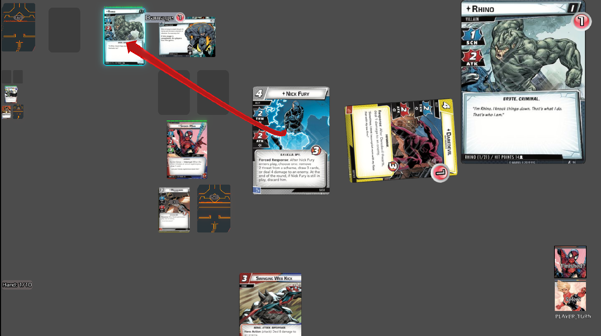
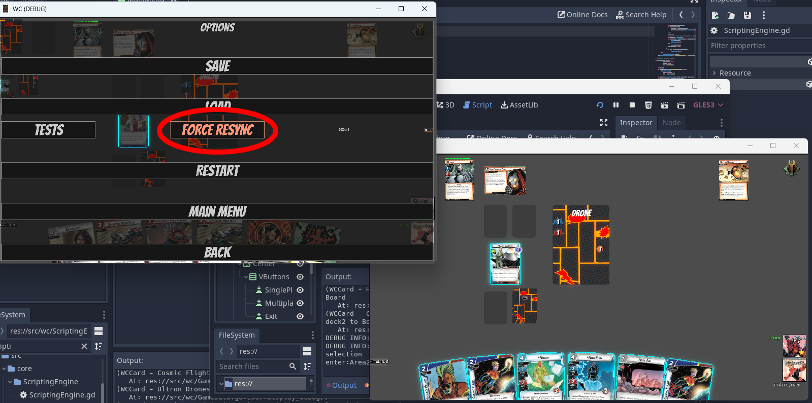
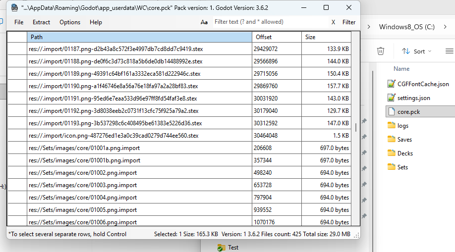

# Warnel Chawpiovs

A card game based on a well known cooperative board game, with full rules enforcement, to play solo or (ultimately) multiplayer

## Shortcuts
* [Installing the game](#users-installing-the-game)
* [Running the game](#users-running-the-game)
* [Users FAQ and Troublshooting](#users-faq-and-troubleshooting)
## Current Status (General)
As of this writing, this simulator supports the Core Box with its 3 villains and 5 heroes. There is no tutorial included, and, although the rules are automatically handled by the engine, it will quickly become confusing if you are not already familar with the original game.

Rules can be found [here](https://images-cdn.fantasyflightgames.com/filer_public/ab/be/abbef836-d5ef-4241-b2bd-1062df73f367/mvc01_learn_to_play_eng-compressed.pdf). (if broken link, go to [fantasy flight's official page](https://www.fantasyflightgames.com/en/products/marvel-champions-the-card-game/), scroll down to "support/rules" and select "Learn to play"

For all intents and purposes, Warnel Chawpiovs works for a single player using 1 or 2 heroes. Other game modes, in particular Multiplayer, are hit and miss. The Multiplayer layer in particular is a disgusting pile of race conditions and I'm not sure I have the skills to fix it for now.
* Single Player Mode:
  * 1 Player, 1 Hero: Generally works well
  * 1 Player, 2 heroes: Should generally work, with the occasional glitch or game-breaking bug
  * 1 Player, 3 or 4 heroes: mostly untested
* Multiplayer Mode:
  * Multiplayer (2 players, 1 hero per player): The multiplayer mode... exists, but that's about it. It is supposed to work but in practice it's difficult to finish a game without running into a freeze, crash or race condition. To mitigate this, the host can try and click on the "force sync" option button to force other clients to reload the host's current board state. 
  * Multiplayer (Other cases): Not tested. Multiplayer isn't in a reliable state at the moment, so more than 2 players, or more than 1 hero per player, hasn't been really tested yet.
 
### Current Status of the Nintendo Switch version
The Switch version requires a hacked console, for example running [Atmosphere](https://github.com/Atmosphere-NX/Atmosphere). The switch port has the same features as the PC version, but it is significantly slower. Without overclocking it can get very slow, in particular if the console is in handheld mode. But because this is a board game, it remains somewhat ok if you don't mind the low FPS. In my opinion the game actually becomes fairly enjoyable if you overclock the console with the excellent [sys_clk](https://github.com/retronx-team/sys-clk)

Playing with more than one hero adds to the CPU load...It works, it just gets significantly slower.

I have personally seen the multiplayer mode (between a PC - as the host of course - and a Nintendo Switch) working on my local network. So I know this works, but the console has to be overclocked, otherwise it loses its connection eventually. This might be fixable, but if you really wish to test multiplayer on a Switch (I don't currently recommend this, with both the Switch port AND multiplayer being quite rough around the edges), for now please overclock the console.

### Linux and Mac Ports
I don't distribute binaries for Linux or Mac at the moment because I don't have ways/time to test those. However people have confirmed to me that it works on these platforms, all you need is Godot to compile the source (or find someone to send you a binary)

## Users: Installing the Game
1. Download the binary and the pck file from the [releases section](https://github.com/frwololo/warnel-chawpiovs/releases), and copy them to any folder on your device (on the Switch, this should probably be in the "switch" folder of your SD card)
2. (optional) get your hands on a pck or zip file containing the images (it should be named core.zip or core.pck) and put it either in the same folder as your binary, or in the game's user folder. **be aware that PCK files are depending on Godot's version, and some PCK files might be specific to a particular version or port of the game. E.g a PCK file that works fine on PC might not necessarily work on Switch**
   * If you skip this step, the game will automatically download images the first time it runs. This requires internet access enabled, and might take a while!
3. That's it, you can run the game. (On Switch, you need to launch it from the homebrew menu - not in applet mode! -)

## Users: Running the game
### Downloading Images and other resources
When you run the game for the first time, Warnel Chawpiovs needs to download some data, including card definitions and card pictures. By default, most of this data is downloaded from https://marvelcdb.com.
Image downloads in particular might take some time, but this should only happen the first time you run the game.

**Alternatively**, it is possible to have all the images packed either in a PCK or a ZIP file at the root of the user folder (PCK are the DLC file format for Godot) with the right structure. See below for folder structure.

### How to play
https://www.youtube.com/watch?v=AbOm5UHoGbE

### Hosting a Multiplayer game
See the Current Status section above for disclaimers about the multiplayer mode.

THe host needs to **forward port 7777** on their computer/router. The rest should be semi automated. Make sure the host clicks on "host" before anybody else clicks on "Join", otherwise things start breaking.

## Users: Folder Structure
The user folder is based on Godot rules. On Windows, it lives in "user_folder"\AppData\Roaming\Godot\app_userdata\WC. On switch, this will most likely be switch/godot/app_userdata/WC/

Relevant files and subfolders of the user folder are:
* settings.json: Settings file
* *.pck and *.zip: all your dlc/mods can live as pck and/or files at the root of the user folder. For example a file named core.pck (or core.zip) can include all images for the core Set 
* Saves: where the savegames live.
* Decks: Hero decks (those follow the format of marvelcdb.com)
* Sets: where the Set definitions and images live. Note: These will override any images with the same name that can be found in the *.pck and*.zip files mentioned above
  * images: image subfolder for set. Each "box" is a subfolder with its own pictures, e.g. images/core/01001a.png
  * SetDefinition_*.json: definition of a given set, typically downloaded "as is" from marvelcdb.com. This describes the cards in a given set, but does not contain the scripting data for these cards (see the Modders section below) 

## Users FAQ and Troubleshooting
* What is Applet mode on Nintendo Switch and why is the game complaining about it?
  * Godot on the Nintendo Switch requires a lot of resources. The homebrew menu on the Nintendo Switch will run in a constrained environment called "applet mode" if you access it "normally" by pressing on the Album icon. In order to run the homebrew menu in the mode required for Godot games to run, you need to insert a game cartridge in the Switch, and press R while starting the game. This will start the Homebrew menu (instead of running the Switch cartridge) in the appropriate mode for Godot games.
* Players can't connect to my multiplayer game
  * Make sure you have forwarded port 7777 on your Router. That is the only strong requirement at the moment.    

## Modders: Adding new cards to the Game
The basics to adding new cards to the game is to choose a specific set from marvelcdb, create a scripts json file for it (in addition to downloading marvelcdb's own json), and modify the settings file to include this set. Specifically:
* open settings.json from the user folder, and modify the "database" entry, by adding a new element to it. For example: *"trors" : "https://marvelcdb.com/api/public/cards/trors.json"* to add *the return of Red Skull* set.
* Next you'll want to create a file *Sets/SetScripts_name.json* where you'll replace *name* with the actual entry key. In our example, *Sets/SetScripts_trors.json*. This should work in the User Sets folders, but has only been tested in the res folder so far
* Now the actual work: you'll want to add an entry for each card in *Sets/SetScripts_trors.json*, that describes the behavior of each card for the engine.
  * inspiration for how to do this can be found in the [core set](Sets/SetScripts_core.json)
 
### Features
* **Complete card rules enforcement** capacity, via provided Scripting Engine. (see [doc](doc/script_doc.html))
* Multiplayer Support (Work in progress)

#### Scripting Engine Features

* Can define card scripts in plain text, using dictionaries.
* Can set cards to trigger off of any board manipulation.
* Can filter the triggers based on card properties, or a special subset.
* Can define optional abilities.
* Can define multiple-choice abilities.
* Can calculate effect intensity based on state of the board during runtime.
* Can request simple inputs from the player during execution.
* Tag-marking scripts which can be filtered by scripts triggering off of them.
* Can store results from one script to use in another.
* Can be plugged into by any object, not just cards.   

## Developers: Source code Structure
* assets: icons, textures, and fonts for the game
* Decks: a series of default decks for the game to start. These are in theory overridden by Decks folder in the User directory
* doc: Documentation for the game and card engine
* fonts: additional fonts
* scripts: offline scripts e.g. in python for various tasks related to the game
* Sets: hardcoded definitions of the game card scripts. These should be overridden by files of the same name in the USer Directory
  * _macros.json: some macros to make writing some scripts a bit less tedious
  * _scenarios.json: the scenarios for each villain/scheme. Describes default modular set, etc...
  * SetScripts_*.json: actual code for the cards for each set
* Test: test files for the test suite
* Themes: default GUI theme for the app 

### src folder
* core: Most of the code from  [Card Game Framework](https://github.com/db0/godot-card-game-framework). This is supposed to be generic code for any card game, but I have heavily modified it and kind of broke the intent. Generally speaking though, nothing should need to be modified in there, in particular if it is specific to WC
* multiplayer: Multiplayer specific layer. Unfortunately, a lot of multiplayer code also lives in the next folder
* WC: overrides and actual code of the game
  * board: 
  * cards: 
  * data:
  * grids:
  * lobby:
  * menus:
  * ScriptingEngine: All the logic for card mechanics and rules enforcment
    *  ScriptingEngine.gd: actual logic for card scripts
    *  GlobalScriptStack: the heart of the multiplayer code and also the stack that handles interrupts, etc...
  * shaders:
  * Announce.gd: 
  * Board.gd: The board on which most "currently in play" cards are. Note that it is separate from piles such as deck, discard, etc...
  * **CardTemplate.gd**: The class that describes each card an its functionality
  * CfControlExtended.gd: General game singleton class in charge of loading cards database, running the game, etc
  * **GameData.gd**: The overlord of the game, centralized singleton that knows almost everything about the game
  * GhostCard.gd: A type of card (extends CardTemplate) specific for "Make the call" to play other players' cards
  * OVUtils.gd: Utility functions specific to gameplay and scripting the cards
  * PhaseContainer.gd: The class in charge of moving phases through the game, going from player phase to villain phase, etc...
  * SP.gd: aka ScriptProperties. Additional functionality for Scripts targets, etc... 
  * WCUtils.gd: utility functions for generic purpose (reading json files, array/dictionary utilities, etc...)   

## Developers: Test suite
### Running the Test suite
No code should be submitted without running the test suite. The test suite is a simple feature in the game that runs basic gameplay scenarios to ensure the overall engine isn't broken. It is an integration test mechanism that tests both cards and the engine.

The test suite needs to be run twice: once as a single player, and a second time in a 2-player multiplayer game.
* To run the single player test suite, start a single player game (e.g. with spider-Man against Rhino). Once the game has loaded, click on options > Tests, then wait until the test suite has run
* To run the multiplayer test suite, start a 2 player multiplayer game (run Godot Twice), e.g. with spider-Man for player 1 and Captain marvel for player 2, against Rhino. On the host machine, click on options > Tests, then wait until the test suite has run.

For tests to be considered succesful, bot the single player and multiplayer tests need to display a "succesful" message at the end.

The "single player" test suite actually also run multi-hero tests on a single machine. The multiplayer tests run those multi hero tests as well, but with one player per hero.

### Adding new tests
New tests can be added in the Test subfolder of the project. They are json files with a simple structure (TODO). Best way to create a new test is to copy/paste and exsiting one and modify it as needed.
test file names need to start with "test_" to b automatically included in the test suite.
Note: If a file named "_tests.txt" exists in the Test folder, it will be used in priority as a list of tests to run. One test file name per line. This can be used e.g. to run a single test to debug issues

## Developers FAQ
* Why Godot 3.x ?
  * The Card Framework I used was designed for Godot 3.5x. Additionally, Godot 3.5x has been ported to multiple homebrew consoles such as the Nintendo Switch, and I really like the idea of my game running on homebrew consoles. 

## Credits

Based on [Card Game Framework](https://github.com/db0/godot-card-game-framework)

Warnel Chawpiovs, by Wololo (https://wololo.net)

Uses the Godot Engine (https://godotengine.org/)

Godot Switch port (https://github.com/Homebrodot)  thanks in particular to fhidalgosola/utnad, Stary2001, cpasjuste, halotroop2288

### Disclaimer
This is a fan-created work and is not affiliated with, endorsed by, or sponsored by Fantasy Flight Games. All characters, settings, and related elements are the property of their respective owners.

## License

This software is licensed undel AGPL3.
